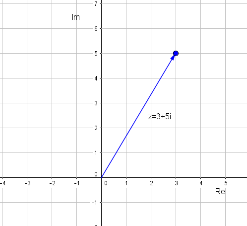
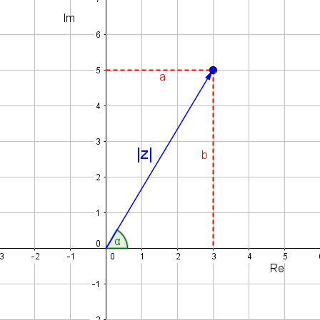

#Tema 3: Nombres complexos

##Nombres imaginaris

Què passa quan volem resoldre equacions del tipus: $x^2+4=0$? Fins ara dèiem que aquestes equacions no tenien solució, perquè l'arrel quadrada d'un nombre negatiu no existeix. De fet, el que volíem dir amb això és que en el conjunt dels nombres reals, les arrels negatives no estan definides.

És per això que algú va pensar de construir un conjunt de nombres on es puguin calcular arrels quadrades negatives i així ampliar el conjunt dels nombres reals. Aquí és doncs on apareixen els [*nombres imaginaris*](https://en.wikipedia.org/wiki/Imaginary_number).

Pensem doncs en l'equació més senzilla de segon grau que dóna com a resultat l'arrel quadrada d'un nombre negatiu:

$$x^2+1=0 \Rightarrow x^2=-1 \Rightarrow x= \pm \sqrt{-1}$$

Sabem perfectament que $\sqrt{-1}$ no és un nombre real. Diem que $\sqrt{-1}$ és un nombre imaginari i el definim amb la lletra $i$:

>$$i=\sqrt{-1} \Rightarrow i^2=-1$$

__Exemple 1__

Com solucionem doncs l'equació: $x^2+4=0$?

$$x^2+4=0 \Rightarrow x^2=-4 \Rightarrow x= \pm \sqrt{-4} \Rightarrow x=\pm \sqrt{4\cdot (-1)} \Rightarrow x=\pm \sqrt{4}\cdot \sqrt{-1} \Rightarrow x= \pm 2i$$

<!-------------------------------------------------->
##El conjunt dels nombres complexos

Anem a veure ara quina seria la solució de l'equació $x^2+2x+5=0$:

$$x=\frac{-2 \pm \sqrt{4-4 \cdot 1 \cdot 5}}{2}=\frac{-2 \pm \sqrt{-16}}{2}=\frac{-2 \pm \sqrt{(-1)\cdot 16}}{2}=\frac{-2 \pm \sqrt{-1}\cdot \sqrt{16}}{2}=\frac{-2 \pm 4i}{2}= -1 \pm 2i$$

Veiem que la solució d'aquesta equació té una part real ($-1$) i una part imaginària ($\pm 2i$). Així és doncs com es defineix un nombre complex:

>Un nombre complex té la forma $a+bi$, ($a,b \in \mathbb{R}$) on $a$ és la part real i $b$ la part imaginària.
El 
Per tant, també podem dir que els nombres reals són nombres complexos els quals tenen __part imaginària=0__ .

Aquesta forma s'anomena __forma binòmica__ d'un nombre complex.

###Complex conjugat

Podem buscar també el complex conjugat d'un nombre $z=a+bi$. Es defineix com: $\bar{z}=a-bi$. 

<!-------------------------------------------------->
##Operacions amb complexos

###Suma i diferència
Per sumar dos nombres complexos sumem les parts reals i les parts imaginàries. Per restar dos nombres complexos, al primer li sumem l'oposat de l'altre.

###Producte

Per efectuar el producte apliquem la propietat distributiva.

__Exemple 2__

Siguin $z_1=3+5i$ i $z_2=2-3i$ dos nombres complexos. Calcula'n la suma, la diferència i el producte.

\begin{align}
z_1+z_2 &=3+5i+2-3i=5+2i \\
z_1-z_2 &=3+5i-(2-3i)=3+5i-2+3i=1+8i \\
z_1 \cdot z_2 &=(3+5i)\cdot(2-3i)= 6-9i+10i-15i^2=6+i-15 \cdot (-1)=21+i \\
\end{align}

D'aquesta manera, ja veieu que si multipliquem dos imaginaris purs (part real=0) obtenim un nombre real: $5i \cdot 9i=45 i^2=-45$.

Una altra cosa a destacar és que l'element neutre del producte (aquell nombre complex que multiplicant-lo per qualsevol nombre dóna el nombre mateix) és z_0=1+0i, o sigui, el nombre amb part real $1$ i part imaginària $0$.

###Quocient

Per dividir dos nombres complexos només cal tenir en compte quelcom semblant al que fèiem quan teníem expressions del tipus $\frac{1}{\sqrt{2}+1}$, que les racionalitzàvem multiplicant pel conjugat. Si dividim els dos nombres complexos de l'exemple 2 obtenim:

$$\frac{z_1}{z_2}=\frac{3+5i}{2-3i}= \frac{3+5i}{2-3i}\cdot \frac{2+3i}{2+3i}=\frac{6+9i+10i-15}{2^2-(3i)^2}=\frac{-9+19i}{4-9(-1)}=\frac{-9+19i}{13}=\frac{-9}{13}+\frac{19}{13}i$$

###Potenciació

Per elevar un nombre complex a una potència, farem:

$$z^n=(a+bi)^n$$

on $n \in \mathbb{N}$. Llavors per desenvolupar l'expressió ens caldrà aplicar la fórmula del [binomi de Newton](http://www.sangakoo.com/ca/temes/binomi-de-newton-i-triangle-de-pascal).

####Potències de $i$

Ja hem vist anteriorment que $i^2=1$. Anem a veure què valen altres potències successives de $i$.

\begin{align}
i^0&=1\\
i^1&=i\\
i^2&=-1\\
i^3&=i^2 \cdot i= -1 \cdot i= -i\\
i^4&=i^2 \cdot i^2=(-1)\cdot(-1)=1\\
i^5&=i \cdot i^4=i\cdot(-1)=-i\\
\end{align}

I així successivament. Cada 4 potències es va repetint la seqüència: $1$, $i$, $-1$, $-i$.

<!-------------------------------------------------->

##Representació dels nombres complexos en el pla
Tal i com hem vist els nombres complexos tenen dues components, la part real i la part imaginària. És per això que no els podem representar a la recta, com els nombres reals, sinó que necessitem el pla. A l'eix de les abcisses hi posem la part real i a l'eix de les ordenades la part imaginària. Un nombre complex $z=a+bi$ el representarem en el pla com el vector $(a,b)$.

__Exemple 3__

Representa en el pla el nombre complex $z=3+5i$.

<!-------------------------------------------------->

##Forma polar d'un nombre complex

Quan representàvem els nombres complexos en el pla vèiem que els podíem definir com un vector de components $(a,b)$ i un angle amb l'eix x:

Per tant, el nombre complex també quedaria definit per el [mòdul](https://ca.wikipedia.org/wiki/Vector_(matem%C3%A0tiques)#M.C3.B2dul_d.27un_vector) d'aquest vector i l'angle que forma amb l'eix x. Aquesta és la __forma polar__ d'un nombre complex:

>\begin{align}
z&=r_{\alpha}\\
r&=|z|=|a+bi|=\sqrt{a^2+b^2} \\
\alpha&=arctan(\frac{b}{a})\\
 0 &\le \alpha \le 2\pi\\
\end{align}

Cal afegir, que si coneixem els signes de $a$ i $b$ podem determinar unívocament l'angle: 

\begin{align}
a>0, b>0 \Rightarrow 1 Q\\
a<0, b>0 \Rightarrow 2 Q\\
a<0, b<0 \Rightarrow 3 Q\\
a>0, b<0 \Rightarrow 4 Q\\
\end{align}

Per passar de forma polar a forma binòmica ens hem de fixar en el mateix dibuix:

\begin{align}
b&=r sin \alpha\\
a&=r cos \alpha\\
\end{align}

<!-------------------------------------------------->

##Forma trigonomètrica

Un cop hem trobat la forma polar, també tenim la forma trigonoomètrica. Si ens fixem en l'expressió anterior i la substituïm a la forma binòmica de nombre complex tenim:

>$$z=a+bi=r cos \alpha+ r sin \alpha \cdot i=r(cos \alpha+i sin \alpha)$$

##Operacions en forma polar

###Multiplicació

Per multiplicar dos nombres complexos en forma polar, es multipliquen els mòduls i se sumen els arguments. Considerem els nombre complexos: $z_1=r_{\alpha}$ i $z_2=s_{\beta}$. Anem a fer el producte. Per multiplicar els termes els expressarem en forma trigonomètrica:

\begin{align}
z_1 \cdot z_2&=r_{\alpha}\cdot s_{\beta}= r(cos \alpha+i sin \alpha)\cdot s(cos \beta+i sin \beta)=\\
&=r\cdot s (cos \alpha cos \beta+i cos \alpha sin \beta + i sin \alpha cos \beta - sin \alpha sin \beta)= \\
&=r\cdot s \big[  (cos \alpha cos \beta - sin \alpha sin \beta) +i (cos \alpha sin \beta + sin \alpha cos \beta) \big] \\
&=r\cdot s \big[  (cos (\alpha + \beta) +i sin ( \alpha + \beta) \big] \\
\end{align}

Això últim ho podem expressar com un nou nombre complex, el nombre complex producte, de mòdul $r\cdot s$ i argument $\alpha+ \beta$. Per tant, per multiplicar dos nombres complexos en forma polar cal multiplicar els mòduls i sumar els arguments:

>$$z_1 \cdot z_2= (r \cdot s)_{\alpha+\beta} $$

###Divisió

De la mateixa manera es pot demostrar que per dividir dos nombres complexos en forma polar només cal dividir els mòduls i restar els arguments:

>$$\frac{z_1}{z_2}= \big(\frac{r}{s}\big)_{\alpha-\beta} $$

###Potenciació

Fer elevar un nombre complex $z=r_\alpha$ a un exponent $n$ equival a multiplicar aquest nombre $n$ vegades per ell mateix:

$$z^n=z\cdot z\cdot z\cdot ....z=r_\alpha \cdot r_\alpha \cdot r_\alpha \cdot ...r_\alpha \cdot=(r \cdot r \cdot r \cdot ... r)_{\alpha + \alpha + \alpha + ... \alpha}=r^{n}_{n \alpha}$$

Per tant, per elevar un nombre complex expressat en forma polar a una potència $n$ només cal elevar el mòdul a aquesta potència i multiplicar l'argument per $n$.

i si ho expressem de forma trigonomètrica obtenim la [__fòrmula de Moivre__](https://es.wikipedia.org/wiki/F%C3%B3rmula_de_De_Moivre):

>$$(cos \alpha + i sin \alpha)^n=cos(n \alpha)+i sin (n \alpha)$$

Per tant, és molt més fàcil calcular les potències dels nombres complexos fent servir la forma polar i no la forma trigonomètrica.

###Radicació

La radicació és l'operació inversa de la potenciació. Volem calcular l'arrel $n$-èssima d'un nombre complex: $\sqrt[n]{r_{\alpha}}$. Definim $s_{\beta}$ com aquesta arrel $n$-èssima. Es compleix per tant:

$$s_{\beta} \equiv \sqrt[n]{r_{\alpha}}\Rightarrow r_{\alpha}=(s_\beta)^n \Rightarrow r_{\alpha}=s^n_{n \beta}$$

Anem a resoldre ara aquesta equació. Igualem per separat els mòduls i els arguments dels 2 nombres complexos:

$$s_{\beta} \Rightarrow \begin{cases} r=s^n &\rightarrow s=\sqrt[n]{r} \\ 
n \beta= \alpha + 360 k & \beta= \frac{\alpha+360k}{n} & k \in \mathbb{N} \end{cases} $$