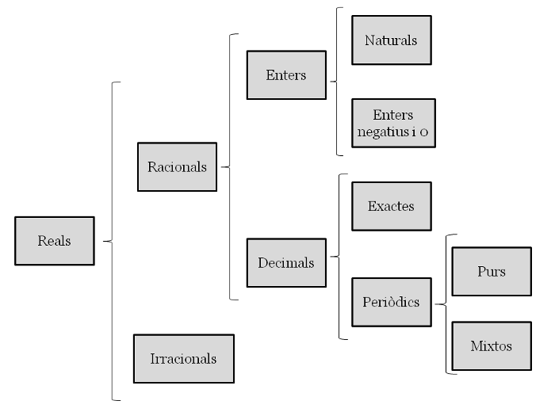
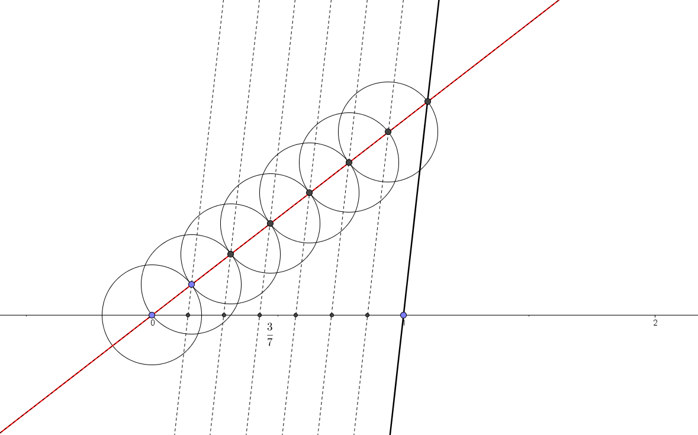
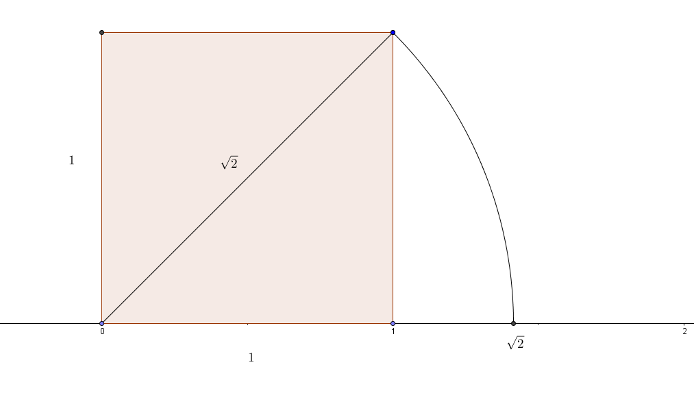
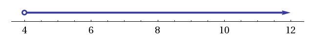
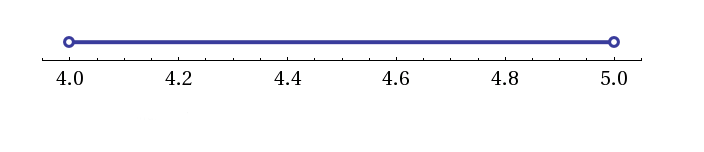
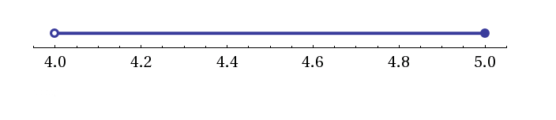
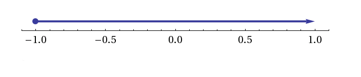
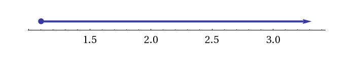
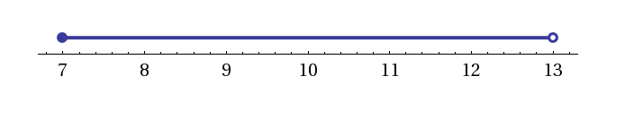
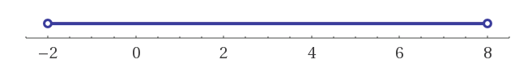

#Tema 1: Nombres reals

## El conjunt dels nombres reals
Els nombres reals es divideixen en __nombres racionals__ __$\mathbb{Q}$__, que són aquells que es poden expressar mitjançant una fracció i els __irracionals__ __$\mathbb{I}$__. Exemples de nombres racionals són $\frac{3}{4}$, $2'5$ i $0'\stackrel\frown{123}$. Els nombres irracionals no es poden expressar com a fracció. El nombre $\pi$ i $\sqrt{5}$ són nombres irracionals.
Un [nombre real](https://en.wikipedia.org/wiki/Real_number) és aquell que es pot representar al llarg d'una recta contínua. Per exemple, tots els nombres associats a mesures físiques (longitud, força, pes, etc) són nombres reals. [Exemples de nombres reals](http://www.mathsisfun.com/numbers/real-numbers.html) són: $1$, $-5$, $\sqrt{3}$, $\pi$, $4'15$, $2'\stackrel\frown{3}$, $\frac{4}{5}$. Al conjunt dels nombres reals se li dóna la lletra __$\mathbb{R}$__.

La [__recta numèrica__](https://ca.wikipedia.org/wiki/Recta_num%C3%A8rica) està formada pel conjunt de tots els nombres reals. Els nombres reals són un __conjunt ordenat__ ja que donats dos nombres, sempre podem determinar-ne el més gran: si $a> b$ al representar-los sobre la recta, $a$ estarà a la dreta de $b$.

Si recordeu de cursos anteriors, els nombres reals es dividien en diversos subconjunts.

Els nombres reals es divideixen en __nombres racionals__ __$\mathbb{Q}$__, que són aquells que es poden expressar mitjançant una fracció i els __irracionals__ __$\mathbb{I}$__. Exemples de nombres racionals són $\frac{3}{4}$, $2'5$ i $0'\stackrel\frown{123}$. Els nombres irracionals no es poden expressar com a fracció. El nombre $\pi$ i $\sqrt{5}$ són nombres irracionals.

Els nombres __naturals__ i els __enters__ ja els coneixeu de cursos anteriors:

$$(\mathbb{N}=\{0, 1, 2, 3, 4,...\}$$
$$\mathbb{Z}=\{...-4, -3, -2, -1, 0, 1, 2, 3, 4,...\}$$

La relació entre els conjunts $\mathbb{N}$, $\mathbb{Z}$ i $\mathbb{Q}$ és la següent: $\mathbb{N} \subset \mathbb{Z} \subset \mathbb{Q}$. Això vol dir que un nombre natural és alhora enter i racional, per exemple.

Els nombres __decimals__ es divideixen en exactes i periòdics. Si el període comença just després de la coma s'anomenen __periòdics purs__  ($0'\stackrel\frown{3}=0'3333....$) i si hi ha alguna xifra que no es repeteix abans s'anomenen __periòdics mixtes__ ($0'2\stackrel\frown{45}=0'2454545....$). Per a tots els nombres decimals podem buscar la seva [fracció generatriu](http://proyectodescartes.org/EDAD/materiales_didacticos/EDAD_4eso_B_cat_reales-JS/index.htm).

## Recta real

Representar nombres sobre la recta real és ben fàcil si són racionals. Si estem parlant d'enters, els sabrem situar sobre la recta sense problema. Però què passa quan hem de situar per exemple, $\frac{3}{7}$ sobre la recta real? Hi ha varis mètodes. El mètode més ràpid és agafar la unitat, fer-ne 7 parts i agafar-ne 3. El mètode més exacte és utilitzant la tècnica de dibuixar un segment des del 0 amb un angle qualsevol i dividir-lo en 7 parts iguals. Seguidament, uneixes l'última part amb l'$1$ de la recta real i traces línies paral.leles a aquesta que passin per les altres divisions. Els punts d'intersecció amb la recta real i aquestes rectes paral.leles et donaran les diferents fraccions $\frac{1}{7}$, $\frac{2}{7}$, $\frac{3}{7}$, etc.

Per representar radicals irracionals sobre la recta real, cal utilitzar el [teorema de Pitàgores](https://ca.wikipedia.org/wiki/Teorema_de_Pit%C3%A0gores). A la figura següent s'hi pot veure la representació gràfica de $\sqrt{2}$.

### Intervals

[Podem entendre un interval com una regió de la recta real](http://proyectodescartes.org/EDAD/materiales_didacticos/EDAD_4eso_B_cat_reales-JS/index.htm). Agafem com a exemple , un de senzill: *Els nombres més grans que $4$*. Si ho representem sobre la recta real obtenim:

Hi ha 3 maneres d'indicar un interval:

* gràficament (gràfic anterior)
* mitjançant una desigualtat, $x>4$
* mitjançant un interval: $(4,+\infty)$.

#### Tipus d'intervals

Els extrems d'un interval són importants. Dir *els nombres més grans que $4$ i més petits que $5$* no és el mateix que dir *els nombres més grans que $4$ i més petits o iguals que $5$*:

 

 

 Els extrems oberts són aquells que no contenen el nombre (per exemple, els nombres més grans que $4)$. Els extrems tancats són aquells que sí el contenen (per exemple, més petits __o iguals__ que $5$.)

### Inequacions

Una inequació d'una incògnita és una desigualtat que cal resoldre. En cas d'haver-hi solució, aquesta és un interval sobre la recta real.

__Exemple 1__

\begin{align}
2x+5 & \ge 3 \\
2x & \ge 3-5 \\
2x & \ge -2 \\
x & \ge -1\\
x & \in \lbrack -1, +\infty)
\end{align}

__Exemple 2__

\begin{align}
-10x+3 & \le 9x -18 \\
-19x & \le -21 \\
19x & \le 21 \\
x & \ge \frac{21}{19}\\
x & \in \lbrack \frac{21}{19}, +\infty)
\end{align}

En aquest cas, quan canviem de signe a una banda de la desigualtat, cal recordar que la desigualtat canvia de sentit.

__Exemple 3__

\begin{cases}
3x - 3 \ge 18 \Rightarrow 3x \ge 21 \Rightarrow x \ge 7 \\
4 (x-10) \lt 12 \Rightarrow 4x - 40 \lt 12 \Rightarrow 4x \lt 52 \Rightarrow x \lt 13
\end{cases}

La solució a aquest sistema són els nombres més grans o iguals que 7 i més petits que 13:

$$ 7 \ge x > 13$$

o bé:

$$x \in \lbrack 7, 13)$$

Aquí no hem parlat de les inequacions de segon grau i una incògnita, per exemple: $ 2x^2-5x+3 > 4$. Per resoldre aquest tipus d'inequacions cal primer resoldre l'equació de segon grau. En [aquest enllaç](http://proyectodescartes.org/EDAD/materiales_didacticos/EDAD_4eso_B_cat_inequacions-JS/index.htm) hi podeu trobar el procediment.

###Valor absolut. Distància. Entorn

De cursos anteriors sabem que el **valor absolut** d'un nombre consisteix en prescindir del seu signe, és a dir: $|-3|=|+3|=3$, i és per tant, positiu.

El valor absolut però es defineix tècnicament com *la distància d'un nombre a l'origen de coordenades*. Per tant, $|x|$ és la distància de $x$ al $0$ de la recta real, i que $|-3|=|+3|=3$ vol dir que tant el $+3$ com el $-3$ es troben a $3$ unitats de distància de l'origen.

Prenent això com a exemple, la **distància** $d$ entre dos nombres de la recta real $a$ i $b$ es defineix com:

$$d_{a,b}=|b-a|=|a-b|$$

i és per tant, sempre un nombre positiu.

####Propietats

La distància compleix també les propietats següents:

1. >$d_{a,b} \ge 0 \forall a,b \in \mathbb{R}$
2. >$d_{a,b} = 0 \Leftrightarrow a=b$
3. >$d_{a,b}= d_{b,a}$
4. >$d_{a,b} \le  d_{a,c}+ d_{c,b} \forall a, b, c  \in \mathbb{R}$

De la mateixa manera podem definir un **entorn** $B$ d'un punt $a$ i radi $r$ com aquell segment de la recta real format pels punts que estan a una distància de $a$ menor que $r$:

$$B(a;r)=\{x \in \mathbb{R} | d(x,a) < r\}$$

o dit d'una altra manera:

$$|x-a|<r$$

__Exemple 4__

Trobeu aquells punts que es troben a una distància de 3 menor que 5 unitats.

Ens estan demanant que resolem la inequació següent:

$$|x-3|<5$$

Només cal trobar un entorn amb centre $3$ i sumar i restar 5 unitats a esquerra i dreta. La solució d'aquesta inequació és l'interval $(-2,8)$:

## Potències

Una potència és una expressió del tipus $a^b$ on $a$ és la base i $b$ l'exponent, ambdós nombres reals. No cal afegir que $a^b$ significa multiplicar $a$ $b$ vegades per ell mateix. En [aquest enllaç](http://proyectodescartes.org/EDAD/materiales_didacticos/EDAD_4eso_B_cat_radicals-JS/index.htm) hi podreu repassar el capítol de potències i radicals de 4t d'ESO.

###Propietats

1. >$a^0=1$
2. >$a^1=a$
3. >$a^{-n}=\frac{1}{a^n}$
4. >$a^m \cdot a^n= a^{m+n}$
5. >$\frac{a^m}{a^n}= a^{m-n}$
6. >$(a^m)^n=a^{n \cdot m}$
7. >$a^n \cdot b^n=(a\cdot b)^n$

## Radicals

L'arrel $n$-èssima d'un nombre real $a$ s'expressa de la manera següent:

$$\sqrt[n]{a}$$

Si $b$ és el resultat de calcular l'arrel $n$-èssima d'$a$, llavors també es compleix que:

$$\sqrt[n]{a}\Longleftrightarrow b^{n}=a$$

$a$ s'anomena __radicand__ i $n$ és l'__índex__ de l'arrel.

Podem també entendre un radical com una potència d'exponent fraccionari:

$$ \sqrt[n]{a^m}= a^{\frac{m}{n}}$$

D'aquesta manera, $\sqrt{2}=2^{\frac{1}{2}}$.

### Propietats

Com ja hem explicat, els radicals són potències d'exponent fraccionari. Per tant, les seves propietats deriven de les propietats de les potències:

1. >$\sqrt[n]{a \cdot b}=\sqrt[n]{a} \cdot \sqrt[n]{b}$
2. >$\sqrt[n]{a}=\sqrt[n \cdot r]{a^r} (r \ne 0)$
3. >$\sqrt[n]{\frac{a}{b}}=\frac{\sqrt[n]{a}}{\sqrt[n]{b}}$
4. >$(\sqrt[n]{a})^m=\sqrt[n]{a^m}$
5. >$\sqrt[n]{\sqrt[m]{a}}=\sqrt[m \cdot n]{a}$

### Extracció i introducció de factors en un radical

Per introduir nombres dins d'un radical, s'ha d'elevar el nombre a una potència igual a l'índex de l'arrel.

__Exemple 5__

Introdueix tots els factors dins de l'arrel:

$$3^5 \cdot 2^8 \cdot 7^3 \cdot \sqrt[3]{2^5 \cdot 7}= \sqrt[3]{(3^5)^3 \cdot (2^8)^3 \cdot (7^3)^3 \cdot 2^5 \cdot 7}=\sqrt[3]{3^{15} \cdot 2^{24} \cdot 7^9 \cdot 2^5 \cdot 7}=\sqrt[3]{2^{29} \cdot 3^{15} \cdot 7^{10}}$$

Per extreure factors d'un radical, primer cal mirar si l'exponent del radicand és més gran que l'índex. Si és així, es podrà treure a fora el factor dividint l'exponent per l'índex del radical. A fora de l'arrel hi quedarà el nombre elevat al quocient de la divisió anterior, i a dins, el nombre elevat al residu de la divisió. Si no tenim el radicand expressat com a producte de factors de nombres primers, caldrà fer abans aquesta operació. Fixeu-vos en l'exemple següent.

__Exemple 6__

Treu tots els factors que puguis del radical:

$$\sqrt[3]{120000}=\sqrt[3]{2^6 \cdot 3 \cdot 5^4}=2^2 \cdot 5 \cdot \sqrt[3]{3 \cdot 5}$$

###Sumes i restes

Diem que dos radicals són __semblants__ si tenen el mateix índex i el mateix radicand. Per exemple $2 \sqrt [5]{3}$ i $\sqrt[5]{3}$ són semblants però no ho són amb $\sqrt{3}$.

Només es poden sumar o restar radicals si són semblants.

__Exemple 7__

$$2\sqrt[5]{21}+4 \sqrt[5]{21}=6 \sqrt[5]{21}$$

###Multiplicacions i divisions

Per multiplicar o dividir radicals han de tenir el __mateix índex__. Si tenen diferent índex els hem de reduir a __índex comú__ tal i com fem amb les fraccions. Llavors es multipliquen o divideixen els radicands.

__Exemple 8__

$$\sqrt[3]{5}\cdot \sqrt{8}=\sqrt[6]{5^2}\cdot\sqrt[6]{8^3}=\sqrt[6]{5^2\cdot 8^3}$$

###Arrel d'una arrel

Per treure l'arrel d'una arrel, es multipliquen els índexs.

__Exemple 9__

$$\sqrt[7]{\sqrt[3]{4}}=\sqrt[21]{4}$$

###Racionalització

En general no es considera elegant donar com a resultat un radical en un denominador. És per això que sempre que tinguem radicals en el denominador d'una fracció s'han d'intentar buscar fraccions equivalents. Mireu els exemples següents.

__Exemple 10__

$$\frac{2}{\sqrt[3]{5}}=\frac{2 \cdot \sqrt[3]{5^2}}{\sqrt[3]{5}\cdot \sqrt[3]{5^2}}=\frac{2 \cdot \sqrt[3]{5^2}}{\sqrt[3]{5^3}}=\frac{2\cdot\sqrt[3]{5^2}}{5}$$

__Exemple 11__

Si en el denominador hi tenim una suma o una resta que contingui radicals, multiplicarem la fracció a dalt i a baix pel conjugat (si és suma, multiplicarem per la mateixa expressió restada i viceversa).

$$\frac{5}{1+\sqrt{3}}=\frac{5}{1+\sqrt{3}}\cdot \frac{1-\sqrt{3}}{1-\sqrt{3}}=\frac{5(1-\sqrt{3})}{1^2-(\sqrt{3})^2}=\frac{5(1-\sqrt{3})}{-2}=-\frac{5}{2}(1-\sqrt{3})$$

## Logaritmes

El $log_a b$, això és, logaritme en base $a$ de $b$, és aquell exponent al qual hem d'elevar $a$ per obtenir $b$ de resultat.

Per exemple, $log_2 8$ és $3$, perquè $2^3=8$. De la mateixa manera, $log_{10} 1000 = 3$ perquè $10^3=1000$. Però quan és $log_2 36$? Quin nombre cal elevar el $2$ per obtenir $36$ de resultat?

$$log_2 36=5'169925....$$

Per tant, el resultat d'un logaritme, que tal i com hem dit, expressa una potència, no té perquè ser enter.

D'altra banda, com que la base $a$ sempre és positiva, $b$ també ho ha de ser. Això és, l'operació $log_a b$ només està definida per a nombres $b$ que siguin positius.

Així doncs, en general:

$$log_a{b}=x \Leftrightarrow a^x=b$$

###Propietats

1. >$a^{log_a b}=b$   

    **Demostració**

    $log_a b=x \Leftrightarrow a^x=b$  
    Com que $x=log_a{b}$, llavors s'obté el resultat desitjat:  
    $a^{log_a{b}}=b$

2. >$log_a a=1$

    El nombre al qual hem d'elevar $a$ per obtenir $a$, lògicament és $1$.

3. >$log_a a^m=m$

    El nombre al qual hem d'elevar $a$ per obtenir $a^m$, lògicament, és $m$

4. >$log_a (p \cdot q)=log_a p + log_a q $

    **Demostració**

    Definim:
    \begin{align}
    log_a p =x \Rightarrow a^x=p \\
    log_a q =y \Rightarrow a^y=q \\
    \end{align}

    Multipliquem les dues equacions:

    $$a^x \cdot a^y=p \cdot q$$

    Producte de potències de la mateixa base, suma d'exponents:

    $$a^{x+y}=p \cdot q$$

    Apliquem logaritmes a banda i banda de l'equació anterior:

    $$log_a(a^{x+y})=log_a(p \cdot q)$$

    $x+y=log_a(p \cdot q)$

    Substituïm $x$ i $y$ pels seus valors:

    $log_a p+log_a q=log_a(p \cdot q)$

5. >$log_a(\frac{p}{q})=log_a p - log_a q$

    Es demostra de la mateixa manera que la propietat 7.

6. >$log_a{b^m}=m\cdot log_a b$

    **Demostració**

    Definim:

    $$x=log_a b\Rightarrow a^x=b$$

    Elevem a banda i banda a una potència $m$:

    $$(a^x)^m=b^m$$

    I potència d'una potència es multipliquen els exponents:

    $$a^{m\cdot x}=b^m$$

    Si prenem logaritmes a banda i banda:

    $$log_a a^{m\cdot x}= log_a {b^m} $$

    Per tant:

    $$m \cdot x=log_a b^m$$

    I si recordem què era $x$:

    $$m \cdot log_a b=log_a b^m$$

###Canvi de base

La calculadora científica no té una tecla per a qualsevol base de logaritmes. De fet, les calculadores més comunes tenen la tecla per calcular el logaritme en base 10, $log$, i el logaritme en base $e$, $ln$, que explicarem més endavant.

Per efectuar un canvi de base de logaritme, hem de tenir en compte la fórmula següent:

>$log_a x = \frac{log_b x}{log_b a}$

**Demostració**  

Definim:  

$$log_a x= y \Leftrightarrow x=a^y$$  

Com que volem expressar el logaritme en base $a$ en una altra base, $b$, prenem logaritmes en base $b$ a banda i banda de l'expressió:  

$$log_b x=log_b {a^y}$$

Apliquem la propietat 6. dels logaritmes i tenim:  

$$log_b x= y \cdot log_b a$$

Si recordem què era $y$:

$$log_b x = log_a x \cdot log_b a$$

Aïllant $log_a x$ obtenim:

$$log_a x = \frac{log_b x}{log_b a}$$

De les propietats anteriors també se'n dedueixen les següents:

\begin{align}
log_a(a) &= 1\\
log_a(1) &=0\\
log_a\big(\frac{1}{a}\big) &=-1\\
log_a(0) &=\nexists\\
\end{align}

__Exemple 12__

Per calcular el $log_5{10}$ a la calculadora, haurem de fer doncs:

$$log_5{10}=\frac{log 10}{log 5}= \frac{1}{log 5}$$

Entenent $log 5$ com el logaritme en base $10$ de $5$.  

###El nombre $e$ i els logaritmes neperians

El [nombre $e$](https://ca.wikipedia.org/wiki/Nombre_e) és una constant matemàtica que és la base principal de molts càlculs, com per exemple, en l'estudi de [l'interès compost](http://proyectodescartes.org/EDAD/materiales_didacticos/EDAD_3eso_cat_progressions-JS/index.htm) d'un crèdit o dipòsit.

És un nombre irracional, això és, té infinits decimals:

$$e=2,718281828459045235....$$

Els __logaritmes naturals__ o __logaritmes neperians__ ($ln x$) són aquells que la seva base és el nombre e. Per exemple, calcular el logaritme neperià de 2 vol dir:

$$ln (2)= 0'6931471.... \Leftrightarrow e^{0'6931471....}=2 $$

Així mateix, per calcular qualsevol logaritme en qualsevol base, podem fer servir la fórmula del canvi de base anterior amb els logaritmes en base l0 ($log$) o base $e$ ($ln$).
