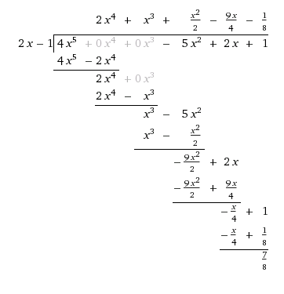

#Tema 4: Polinomis

##Generalitats

Un [polinomi](http://proyectodescartes.org/EDAD/materiales_didacticos/EDAD_4eso_B_cat_polinomios-JS/index.htm) és una expressió algebraica que consisteix en una suma de __termes__. Cadascun dels termes, anomenats __monomis__, està format per una o més incògnites elevades a una potència i multiplicades per un nombre anomenat __coeficient__.

###Parts d'un polinomi. Tipus de polinomis.

1. __Grau__: és el terme que té l'exponent més gran del polinomi.
2. __Terme independent__: és el terme que no té incògnita.
3. __Polinomi ordenat__: és aquell que els seus termes estan ordenats en grau decreixent.
4. __Polinomi complet__: és aquell que començant pel terme de grau més gran, té tots els termes de grau inferior fins arribar al terme independent.
5. __Polinomi oposat__: és el polinomi que obtenim quan canviem de signe tots els termes d'un polinomi.

<!-------------------------------------------------->

##Operacions amb polinomis

Recordarem aquí les operacions bàsiques entre polinomis a través d'un exemple.

__Exemple 1__

Donats els polinomis: $P(x)=4x^5+2x+1$ i $Q(x)=2x^5+6x^2+3x$ calcula:

1. $P(x)+Q(x)$
2. $P(x)-Q(x)$
3. $P(x)\cdot Q(x)$
4. $P(3)$
4. $P(x) \div (2x-1)$
5. $P(x) \div (x-2)$

$P(x)+Q(x)=4x^5+2x+1+2x^5+6x^2+3x=6x^5+6x^2+5x+1$

$P(x)-Q(x)=4x^5+2x+1-(2x^5+6x^2+3x)=2x^5-6x^2-x+1$

\begin{align}
    P(x) \cdot Q(x)&=(4x^5+2x+1)\cdot(2x^5+6x^2+3x)\\
    &=8x^{10}+24x^7+12x^6+4x^6+12x^3+6x^2+2x^5+6x^2+3x\\
    &=8x^{10}+24x^7+16x^6+2x^5+12x^3+12x^2+3x
\end{align}

$P(3)=4 \cdot 3^5+2 \cdot 3+1=979$

$P(x) \div (2x-1)$

$P(x) \div (x-2)$

Per fer aquesta divisió utilitzarem la [regla de Ruffini](http://proyectodescartes.org/EDAD/materiales_didacticos/EDAD_4eso_B_cat_polinomios-JS/quincena3_contenidos_4a.htm) que vam veure l'any passat, que ens permet dividir un polinomi per un altre del tipus $(x-a)$ d'una manera molt més ràpida:

$$
\begin{array}{c|r r r r r}
 & 4 & 0 & 0 & 2 & 1 \\
 &  &  &  & \\
2 &  & 8 & 16 & 32 & 68 \\
\hline
 & 4 & 8 & 16 & 34 &\boxed{64}
\end{array}
$$

Per tant, el quocient de dividir $P(x)$ per $(x-2)$ és $Q(x)=4x^4+8x^3+16 x^2+34$ i el residu $64$.

<!-------------------------------------------------->

##Identitats notables. Binomi de Newton

###Identitats notables
Recordem un moment les identitats notables de cursos passats:

\begin{align}
    (a+b)^2&=a^2+b^2+2ab\\
    (a-b)^2&=a^2+b^2-2ab\\
    (a+b)\cdot &(a-b)=a^2-b^2
\end{align}

###Binomi de Newton

El binomi de Newton ens permet calcular expressions del tipus $(a+b)^n$, $n > 2$. Per fer-ho cal construir el [Triangle de Pascal o de Tartaglia](https://ca.wikipedia.org/wiki/Triangle_de_Tartaglia), que ens donarà els coeficients de cadascun dels termes quan desenvolupem el binomi:

$$\begin{matrix}
    &&&&&1\\
    &&&&1&&1\\
    &&&1&&2&&1\\
    &&1&&3&&3&&1\\
    &1&&4&&6&&4&&1\\
    1&&5&&10&&10&&5&&1
    \end{matrix}$$

La primera fila correspon $n=0$ i així successivament. Comencem el triangle amb tres $1$ i llavors cada element de la fila següent s'obté sumant els dos elements de la fila superior.

Per desenvolupar el binomi, ara ja tenim els coeficients dels termes. Començarem per elevar a la màxima potència el primer element del binomi ($a$) i el segon ($b$ l'elevarem a zero. Anirem disminuint l'exponent del primer terme i augmentant el del segon terme tal i com es mostra a l'exemple següent:

__Exemple 2__

Calcula $(x+3)^5$. Si mirem el triangle, per $n=5$ els coeficients són: $1$, $5$, $10$, $5$, $1$. Per tant:

\begin{align}
(x+3)^5&=1x^5 3^0+5x^4 3^1+10 x^3 3^2+10 x^2 3^3+ 5 x^1 3^4+1x^0 3^5\\
&=x^5+15x^4+90x^3+270 x^2+405 x+243
\end{align}

<!-------------------------------------------------->

##Teorema del residu

>El residu de dividir un polinomi $P(x)$ per $(x-a)$ és igual a $P(a)$

__Demostració__

Si dividim $P(x)$ per $(x-a)$ obtenim un polinomi quocient $Q(x)$  i un reste $R$ de grau 0 (ja que el divisor té grau 1). Si apliquem la prova de la divisió es compleix que:

$$P(x)=Q(x) \cdot (x-a)+R \Rightarrow P(a)=Q(a) \cdot (a-a)+R \Rightarrow P(a)=R$$

__Exemple 3__

Quin és el residu de dividir $P(x)=4x^5+2x+1$ per $x+1$?

Podem entendre $x+1$ com $x+(-1)$. Per tant, per saber el residu de la divisió només ens cal calcular $P(-1)$:

$$P(-1)=4(-1)^5+2(-1)+1=-5$$

El residu és per tant, $-5$.

<!-------------------------------------------------->

##Arrels d'un polinomi

Diem que $a$ és __arrel__ de $P(x)$ si el residu de dividir $P(x)$ per $(x-a)$ és $0$. De fet, això és el mateix que dir que $P(x)$ és __divisible__ per $(x-a)$.

D'altra banda, dir que $a$ és arrel d'un polinomi és equivalent que dir que $a$ és solució de l'equació $P(x)=0$. Anem-ho a veure. Com que el residu és zero, si apliquem la prova de la divisió obtenim:

$$P(x)=(x-a)\cdot Q(x)$$

Si igualem ara $P(x)$ a zero obtenim:

$$(x-a)\cdot Q(x)=0 \begin{cases} x=a \\ Q(x)=0
\end{cases}$$

A més, i aplicant el teorema del residu, també es complirà que $P(a)=0$.

Així doncs, resumint, tenim que les afirmacions següents són equivalents:

> 1. $a$ és arrel de $P(x)$
> 2. $P(x)$ és divisible per $(x-a)$
> 3. $P(a)=0$
> 4. $a$ és solució de $P(x)=0$

Es pot demostrar també que:

>Si $a$ és arrel entera de $P(x) \Rightarrow$ $a$ és __divisor del terme independent__ del polinomi.

__Demostració__

Considerem el polinomi $P(x)=a_n x^n+ a_{n-1} x^{n-1}+...+a_1 x+a_0$. Sigui $b$ arrel de $P(x)$ llavors es compleix:

$$P(b)=a_n b^n+a_{n-1}b^{n-1}+...+a_1 b+a_0=0$$

si aïllem $a_0$ i traiem factor comú a l'altre costat de la igualtat obtenim:

\begin{align}
    a_0&=-a_n b^n-a_{n-1}b^{n-1}-...-a_1 b\\
    &=b\cdot(-a_n b^{n-1}-a_{n-1} b^{n-1}-...-a_1)
\end{align}

per tant, $b$ és nessàriament múltiple del terme independent $a_0$.

###Càlcul de les arrels d'un polinomi

Tal i com hem vist, calcular les arrels d'un polinomi $P(x)$ és equivalent a resoldre l'equació $P(x)=0$. En general, i pel [teorema fonamental de l'àlgebra](https://ca.wikipedia.org/wiki/Teorema_fonamental_de_l%27%C3%A0lgebra), se sap que un polinomi té tantes arrels com grau té el polinomi. Com que nosaltres només buscarem arrels enteres, un polinomi de grau $n$ tindrà com a màxim $n$ arrels enteres.

####El grau de $P(x) < 3$

En aquest cas, solucionarem l'equació de primer grau o de segon grau que se'n deriva. Les arrels del polinomi són les solucions de l'equació de segon grau.

####El grau de $P(x)>3$

Llavors haurem d'aplicar altres tècniques per trobar les arrels. Tal i com hem vist, aquestes arrels seran divisors del terme independent (el contrari no és cert, els divisors del terme independent d'un polinomi no sempre són arrels).

Una manera de fer-ho seria trobar totes les arrels del polinomi i llavors provar si el valor numèric del polinomi per cadascuna d'elles és zero. A la pràctica aquest mètode és una mica feixuc i el que fem és, un cop tenim els divisors del terme independent, dividim $P(x)$ per cadascun d'ells amb Ruffini, i si el residu ens dóna zero, això voldrà dir que són arrels del polinomi. En aquest procés, quan arribem a un polinomi de grau 2, llavors resulta més ràpid resoldre l'equació de segon grau que se'n deriva.

__Exemple 4__

Troba les arrels de $P(x)=x^3-6x^2+11x-6$

Anem a veure quins són els divisors del terme independent: $\pm 1$, $\pm 2$, $\pm 3$, $\pm 6$.

$$
\begin{array}{c|r r r r}
 & 1 & -6 & 11 & -6 \\
 &  &  &  & \\
1 &  & 1 & -5 & 6 \\
\hline
 & 1 & -5 & 6 & \boxed{0}
\end{array}
$$

Arribats en aquest punt, veiem que 1 és arrel. Podríem continuar fent Ruffini amb els candidats restants, però com que el quocient és un polinomi de segon grau, $x^2-5x+6$ és més fàcil solucionar l'equació de segon grau i trobar les arrels:

$$x^2-5x+6=0 \begin{cases} x=3 \\ x=2
\end{cases}$$

Per tant,$P(x)$ té 3 arrels enteres: $1$, $2$ i $3$, i això vol dir que és divisible per $(x-1)$, $(x-2)$ i $(x-3)$.

<!-------------------------------------------------->
##Factorització de polinomis

Factoritzar un polinomi consisteix en descomposar-lo com a producte de polinomis de grau menor. Per fer-ho, seguirem els passos següents:

1. __Treure factor comú__

    Mirarem primer si podem extreure algun factor numèric o de variable a davant del polinomi. Per exemple, donat el polinomi $P(x)=4x^4-2x^3+6x$, el podem començar a factoritzar com: $P(x)=2x(2x^3-x^2+3)$.

2. __Identitats notables__

    A vegades a simple vista, veiem que una expressió algebraica correspon a una de les tres identitats notables. Exemple, si hem de fatoritzar $P(x)=4x^4-20x^2+25$, primer mirarem si ho podem expressar com una identitat notable. Aquest cas és molt clar i el podem expressar com: $P(x)=(2x^2-5)^2$

3. __Arrels del polinomi__

    Un cop hem comprovat els dos estadis anteriors, prosseguirem a trobar les arrels del polinomi tal i com hem vist en l'apartat anterior. Vam veure que si $x=a$ és arrel de $P(x)$ llavors $P(x)$ era divisible per $(x-a)$. Això vol dir que puc expressar $P(x)$ com a producte d'un factor $(x-a)$ i un $Q(x)$. Aquest quocient pot tenir més arrels i el podem seguir descomposant. La idea és descomposar un polinomi de grau $n$ com a producte de polinomis de grau 1 amb factors del tipus $(x-a)$.

__Exemple 5__

Factoritza el polinomi $P(x)=x^7-x^6-4x^4$.

Comprovem que podem treure factor comú:

$$P(x)=x^7-x^6-4x^4=x^4(x^3-x^2-4)$$.

Anem a factoritzar ara el segon factor: $x^3-x^2-4$. Veiem que no correspon a cap identitat notable. El pas següent és mirar els divisors del terme independent i provar quins són arrels del polinomi.

Divisors del terme independent: $\pm 1$, $\pm 2$, $\pm 4$. Provem cada cas, o bé per Ruffini comprovant que el residu de fer la divisió de $x^3-x^2-4$ per $(x-a)$ és zero o bé aplicant el Teorema del Residu i calculant el valor numèric del polinomi quan $x=a$. Si ho fem, veiem que només quan $a=2$ el residu esdevé zero:

$$
\begin{array}{c|r r r r}
 & 1 & -1 & 0 & -4 \\
 &  &  &  & \\
2 &  & 2 & 2 & 4 \\
\hline
 & 1 & 1 & 2 & \boxed{0}
\end{array}
$$

Com que hem comprovat totes les altres possibles arrels i el residu no ens ha donat zero, aquest polinomi no es pot descomposar més. Per tant, la descomposició en factors de $P(x)$ esdevé:

$$P(x)=x^4(x-2)(x^2+x+2)$$

<!-------------------------------------------------->

##Màxim comú divisor i mínim comú múltiple de dos polinomis

Per trobar el màxim comú divisor (mcd) i el mínim comú múltiple (mcm) de dos polinomis $P(x)$ i $Q(x)$ cal fer:

1. Factoritzar cada polinomi
2. $mcm(P(x),Q(x))=$ Factors comuns i no comuns amb l'exponent més gran
3. $mcd(P(x),Q(x))=$ Factors comuns amb l'exponent més petit

__Exemple 6__

Troba el mcd i el mcm dels polinomis $P(x)=x^3+5x^2+3x-9$ i $Q(x)=x^3+4x^2-21x$

Si els factoritzo aplicant el procediment anterior veig que:

\begin{align}
    P(x)&=x^3+5x^2+3x-9=(x-1)(x+3)^2\\
    Q(x)&=x^3+4x^2-21x=x(x-3)(x+7)
\end{align}

Per tant:

\begin{align}
    mcm(P(x),Q(x))&=x(x-3)(x+7)(x-1)(x+3)^2\\
    &=x^6+9x^5+2x^4-102x^3-99x^2+189x\\
    mcd(P(x),Q(x))&=1
\end{align}

Quan dos polinomis només tenen com a mcd el nombre $1$ diem que són _polinomis primers entre ells_.

<!-------------------------------------------------->

##Fraccions algebraiques

De la mateixa manera que podem parlar de mcd i mcm entre dos polinomis, també podeu parlar de fraccions:

>$\frac{P(x)}{Q(x)}$ és una fracció algebraica si $P(x)$ i $Q(x)$ són polinomis amb $Q(x) \ne 0$.

###Fraccions equivalents

>Dues fraccions algebraiques $\frac{P(x)}{Q(x)}$ i  $\frac{R(x)}{T(x)}$ són equivalents si es compleix: $P(x)\cdot T(x)=Q(x)\cdot R(x)$

__Exemple 7__

Les fraccions algebraiques $\frac{x^4-2x^3+2x-1}{x^3-3x+2}$ i $\frac{x^2-1}{x+2}$ són equivalents:

\begin{align}
    (x^4-2x^3+2x-1)(x+2)&=(x^3-3x+2)(x^2-1)\\
    x^5-4x^3+2x^2+3x-2&=x^5-4x^3+2x^2+3x-2
\end{align}

###Fracció irreductible

També podem trobar la fracció irreductible en aquest cas. Quan dividim numerador i denominador pel mcd dels dos polinomis obtenim una fracció irreductible. Per fer-ho, caldrà factoritzar els polinomis numerador i denominador i simplificar els factors comuns.

__Exemple 8__

$$\frac{x^4-2x^3+2x-1}{x^3-3x+2}=\frac{(x-1)^3(x+1)}{(x+2)(x-1)^2}=\frac{x^2-1}{x+2}$$

###Suma i resta de fraccions algebraiques

Per sumar o restar fraccions algebraiques, en cas de no tenir el mateix denominador, caldrà buscar el mcm dels denominadors i reduir-les a denominador comú.

__Exemple 9__

$$\frac{1}{x-1}+\frac{1}{x+1}=\frac{x+1}{x^2-1}+\frac{x-1}{x^2-1}=\frac{x+1+x-1}{x^2-1}=\frac{2x}{x^2-1}$$

###Multiplicació i divisió

Procedirem de la mateixa manera que ho fèiem amb les fraccions.

__Exemple 10__

\begin{align}
    \frac{x+1}{x+2}\cdot \frac{x-1}{x+2}&=\frac{(x+1)(x-1)}{(x+2)(x+2)}=\frac{x^2-1}{(x+2)^2}\\
    \frac{x+1}{x+2}\div \frac{x-1}{x+2}&=\frac{(x+1)(x+2)}{(x+2)(x-1)}=\frac{x^2+3x+2}{x^2+x-2}
\end{align}
