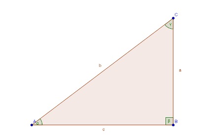
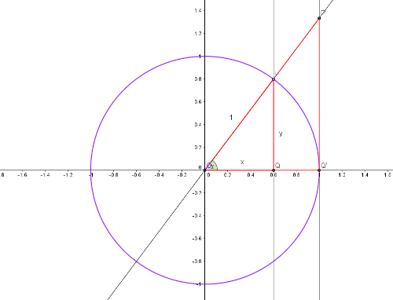
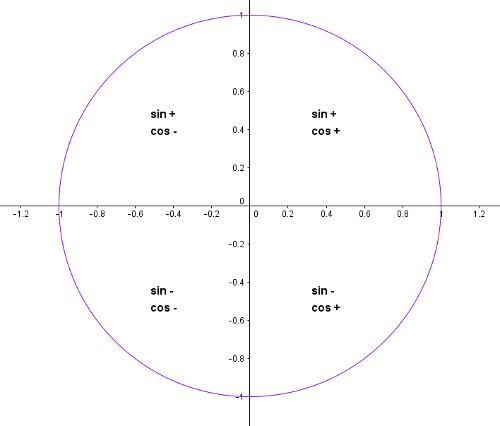
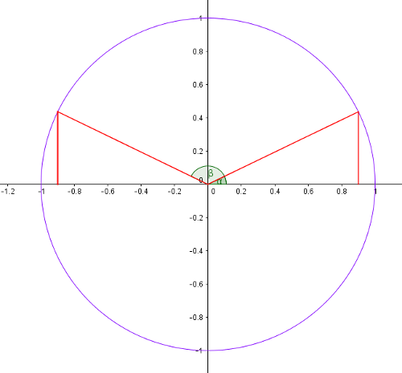
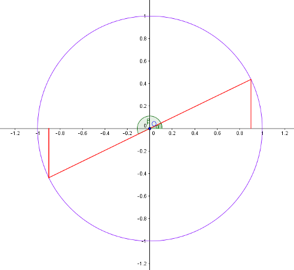
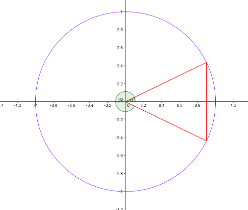
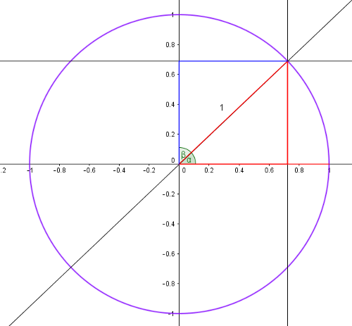
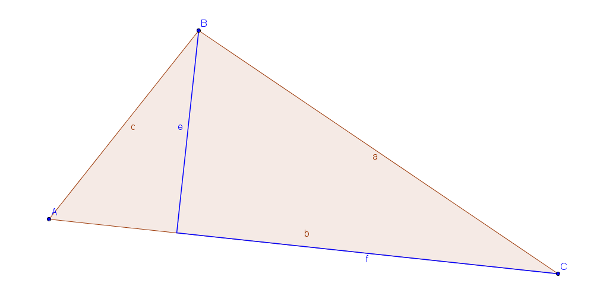
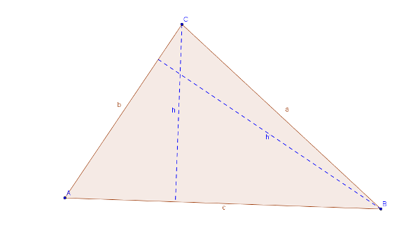

#Tema 2: Trigonometria

##Raons trigonomètriques

L'any passat vau veure com es definien les raons trigonomètriques d'un angle agut a partir d'un triangle rectangle.

En el triangle rectangle que veiem, les raons trigonomètriques de  l'angle $\alpha$ (vèrtex $A$) són les següents:

| Raó        | magnitud           |
| ------------- |-------------|
| $sin \alpha$      | $\frac{a}{b}$      |
| $cos \alpha$ | $\frac{c}{d}$      |
| $tg \alpha$ | $\frac{a}{c}$      |

A partir d'aquestes 3 raons trigonomètriques se'n poden definir unes altres 3, encara que són menys utilitzades. La *secant*, la *cosecant* i la *cotangent*:

| Raó        | Definició           |
| ------------- |-------------|
| $sec \alpha$      | $\frac{1}{cos \alpha}$      |
| $cosec \alpha$ | $\frac{1}{ sin \alpha}$      |
| $cot \alpha$ | $\frac{1}{tg \alpha}= \frac{cos \alpha}{ sin \alpha}$      |

###Raons de 30º, 45º, 60º, 90º i 180º graus

Aquests 4 angles surten molt sovint en diferents càlculs i és per això que és bo de recordar les seves raons trigonomètriques. Les podeu veure escrites a la taula següent:

| Raó        | $30^o$           |$45^o$           |$60^o$           |$90^o$           |$180^o$           |
| ------------- |-------------|-------------|-------------|-------------|-------------|
| $sin$        |         $\frac{1}{2}$   |     $\frac{\sqrt{2}}{2}$        |         $\frac{\sqrt{3}}{2}$    | $1$        | $0$          |
| $cos$        |   $\frac{\sqrt{3}}{2}$        |     $\frac{\sqrt{2}}{2}$      |       $\frac{1}{2}$      |        $0$   |        $-1$   |
| $tg$        |   $\frac{\sqrt{3}}{3}$         |      $1$     |      $\sqrt{3}$       |      $\nexists$ |        $0$   |

Hi ha una regla mnemotècnica per recordar les raons de 30, 45 i 60 graus. Si ens fixem en la part de la taula que conté aquests valors, només cal per la fila del sinus escriure $1$, $2$ $3$ en aquest ordre. Llavors prenem l'arrel d'aquests valors (i recordem que $\sqrt{1}=1$). Finalment dividim el resultat per $2$ i ja tenim els sinus. Pel que fa els cosinus, escrivim $3$, $2$, $1$per 30, 45 i 60 graus respectivament. Després repetim l'operació anterior. Ja tenim els cosinus. Per les tangents, és la divisió del sinus entre el cosinus.
##La circumferència unitat

<!-------------------------------------------------->

Construïm una circumferència de radi $1$ tal i com podem veure a la figura.
Definim un punt $P(x,y)$ sobre la circumferència. Aquest punt defineix un angle $\alpha$ en el primer quadrant. Dibuixem també els triangles $OPQ$ i $OP'Q'$ (descarregueu-vos el fitxer [geogebra](../ggb/circumferencia_unitat_2.ggb)):

Anem a veure quines són les raons trigonomètriques de l'angle $\alpha$:

$$sin \alpha=\frac{PQ}{OP}=\frac{y}{1}=y$$
$$cos \alpha=\frac{OQ}{OP}=\frac{x}{1}=x$$

Per la tangent d'$\alpha$ veiem que els triangles $OQP$ i $OQ'P'$ estan en [posició de Tales](http://proyectodescartes.org/EDAD/materiales_didacticos/EDAD_2eso_cat_semblan%C3%A7a_pitagores-JS/index.htm), per tant, són *semblants* i els seus costats són proporcionals. Així doncs, es compleix:

$$tg \alpha=\frac{PQ}{OQ}=\frac{P'Q'}{OQ'}$$

i del gràfic deduïm $PQ=y$, $OQ=x$ i $OQ'=1$. Per tant:

$$tg \alpha=\frac{x}{y}=P'Q'$$

La tangent és gràficament la longitud del segment tangent a la circumferència des de $P'$ fins a $Q'$.

Aquesta circumferència ens permet també determinar el signe dels sinus i cosinus dels angles de qualsevol quadrant:

Per tant, l'angle $0^o$ que està en el primer quadrant, té cosinus màxim ($1$) i sinus $0$. A mida que ens movem en la direcció contrària a les agulles del rellotge, el cosinus disminueix i el sinus augmenta. En arribar a l'angle de $90^o$, el sinus és màxim ($1$) i el cosinus esdevé llavors $0$.

Una altra cosa que podem aprendre de la circumferència és la relació entre sinus i cosinus d'un angle qualsevol. Sabem que l'equació d'una circumferència és $x^2+y^2=R^2$, on $R$ és el radi de la circumferència. Si ho traduïm al nostre exemple ($sin \alpha=x$, $cos \alpha=y$ i $R=1$) obtenim:

>$$sin^2 \alpha+ cos^2 \alpha= 1$$

La circumferència unitat també ens permet determinar els sinus i cosinus dels angles $0^o$, $90^o$, $180^o$ i $270^o$ amb facilitat.

###Reducció al primer quadrant

Qualsevol angle sobre la circumferència unitat es pot relacionar amb un angle del primer quadrant.

1. __Segon quadrant__

    Un angle del segon quadrant sempre es pot expressar com  $180^o -\alpha$ on $\alpha$ és un angle del 1r quadrant. Per tant:        

    $$sin(180^o -\alpha)=sin \alpha$$      

    $$cos(180^o -\alpha)=-cos \alpha$$

    

    __Exemple 1__

    Dóna les raons trigonomètriques de l'angle $150^o$ relacionant-ho amb un angle del primer quadrant.

    Sabem que: $150^o=180^o-30^o$ per tant:

    $$sin(150^o)=sin (30^o)=\frac{1}{2}$$      

    $$cos(150^o)=-cos (30^o)=-\frac{\sqrt{3}}{2}$$

2. __Tercer quadrant__

    Un angle del segon tercer sempre es pot expressar com $180^o +\alpha$ on $\alpha$ és un angle del 1r quadrant. Per tant:

    $$sin(180^o +\alpha)=-sin \alpha$$
    $$cos(180^o +\alpha)=-cos \alpha$$

    

3. __Quart quadrant__

    Un angle del quart quadrant sempre es pot expressar com $360^o-\alpha$ on $\alpha$ és un angle del 1r quadrant. Per tant:

    $$sin(360^o-\alpha)=-sin \alpha$$
    $$cos(360^o-\alpha)=cos \alpha$$

    

###Raons trigonomètriques d'angles complementaris

Dos angles $\alpha$ i $\beta$ són complementaris si sumats donen l'angle recte: si $\alpha + \beta=90^o$. Del dibuix següent és fàcil deduir quina relació hi ha entre les seves raons trigonomètriques:

$$sin \alpha= cos \beta$$
$$cos \alpha= sin \beta$$

##Raons trigonomètriques de l'angle suma i l'angle diferència

A vegades ens pot interessar saber les raons trigonomètriques d'una suma d'angles ($\alpha+ \beta$) expressades en funció de les raons trigonomètriques dels angles sumands. A continuació us donem les fòrmules que ho expressen. En aquestes línies no demostrarem les identitats, però si teniu curiositat, ho podeu trobar [aquí](https://en.wikipedia.org/wiki/List_of_trigonometric_identities#Angle_sum_and_difference_identities).

>1. $sin(\alpha + \beta)=sin \alpha \cdot cos \beta + cos \alpha \cdot sin \beta$
>2. $sin(\alpha - \beta)=sin \alpha \cdot cos \beta - cos \alpha \cdot sin \beta$
>3. $cos(\alpha + \beta)=cos \alpha \cdot cos \beta - sin \alpha \cdot sin \beta$
>4. $cos(\alpha - \beta)=cos \alpha \cdot cos \beta + sin \alpha \cdot sin \beta$

## Sinus i cosinus de l'angle doble

A partir de les fòrmules anteriors puc calcular les fòrmules de l'angle doble. Si vull calcular les raons de l'angle $2\alpha$ és el mateix que les fòrmules de l'angle suma substituïnt $\alpha+\beta$ per $\alpha + \alpha=2\alpha$:

>$$sin (2\alpha)=sin \alpha \cdot cos \alpha+ cos \alpha \cdot sin \alpha=2sin \alpha cos \alpha$$
>$$cos(2\alpha)=cos \alpha \cdot cos \alpha - sin \alpha \cdot sin \alpha=cos^2 \alpha - sin ^2 \alpha$$

__Exemple 2__

A partir de les fòrmules anteriors,comprova que les raons trigonomètriques de l'angle $90^o$ són $sin 90$ i $cos 90$ a partir de les raons trigonomètriques de $45^o$.

$$sin 90=2 sin 45 cos 45= 2 \frac{\sqrt{2}}{2}\frac{\sqrt{2}}{2}=1$$
$$cos 90= cos^2 45- sin^2 45=(\frac{\sqrt{2}}{2})^2-(\frac{\sqrt{2}}{2})^2=0$$

## Sinus i cosinus de l'angle meitat

Per trobar les fòrmules de l'angle meitat hem de partir de l'equació del cosinus de l'angle doble però substituïnt a tot arreu, $\alpha$ per $\frac{\alpha}{2}$. Llavors obtenim el següent:

$$cos \alpha=cos^2 \frac{\alpha}{2}-sin^2 \frac{\alpha}{2}$$

D'altra banda també sabem que qualsevol angle compleix que la suma dels quadrats del seu sinus i del seu cosinus és $1$. Això aplicat a l'angle meitat i girant l'equació ens dóna:

$$1=sin^2 \frac{\alpha}{2}+cos^2 \frac{\alpha}{2}$$

Si __sumem__ aquestes dues equacions obtenim:

$$1+cos \alpha= 2 cos^2 \frac{\alpha}{2}$$

I si aïllem $cos^2 \frac{\alpha}{2}$:

>$$cos \frac{\alpha}{2}= \pm \sqrt{\frac{1+cos \alpha}{2}} $$

El signe dependrà del quadrant el qual pertanyi l'angle.

Per obtenir el sinus de l'angle meitat només cal __restar__ enlloc de sumar les equacions inicials:

$$1-cos \alpha= 2 sin^2 \frac{\alpha}{2}$$

I si aïllem $sin^2 \frac{\alpha}{2}$:

>$$sin \frac{\alpha}{2}= \pm \sqrt{\frac{1-cos \alpha}{2}} $$

__Exemple 3__

Calculeu les raons trigonomètriques de $15^o$ a partir de les de l'angle $30^o$.

$$sin 15=\sqrt{\frac{1-cos 30}{2}}=\sqrt{\frac{1-\frac{\sqrt{3}}{2}}{2}}=...=\frac{\sqrt{2-\sqrt{3}}}{2}$$

$$cos 15=\sqrt{\frac{1+cos 30}{2}}=\sqrt{\frac{1+\frac{\sqrt{3}}{2}}{2}}=...=\frac{\sqrt{2+\sqrt{3}}}{2}$$

<!-------------------------------------------------->

##Transformació de sumes en productes

A vegades ens pot interessar expressar les sumes de raons trigonomètriques de dos angles qualsevol en productes. Anem a deduir aquestes fórmules.

Considerem les fórmules del sinus de la suma i de la diferència d'angles escrites anteriorment. Anem a sumar aquestes fórmules i també a restar-les. Obtenim, respectivament:

\begin{align}
    sin (\alpha+\beta)+sin(\alpha-\beta)=2 sin \alpha cos \beta \\
    sin (\alpha+\beta)-sin(\alpha-\beta)=2 cos \alpha sin \beta\\
\end{align}

Fem el mateix amb les fórmules del cosinus de la suma i de la diferència d'angles:

\begin{align}
    cos (\alpha+\beta)+cos(\alpha-\beta)=2 cos \alpha cos \beta \\
    cos (\alpha+\beta)-cos(\alpha-\beta)=-2 sin \alpha sin \beta\\
\end{align}

Ara proposem  un canvi de base en aquestes equacions. Anomenem:

\begin{align}
\alpha+\beta=A \Rightarrow \alpha=\frac{A+B}{2} \\
\alpha-\beta=B \Rightarrow \beta=\frac{A-B}{2} \\
\end{align}

Substituïm $\alpha$ i $\beta$ pels seus respectius valors a les 4 equacions de dalt i obtenim:

>\begin{align}
    sin A + sin B = 2 sin (\frac{A+B}{2}) \cdot cos (\frac{A-B}{2}) \\
    sin A - sin B = 2 cos (\frac{A+B}{2}) \cdot sin (\frac{A-B}{2}) \\
    cos A + cos B = 2 cos (\frac{A+B}{2}) \cdot cos (\frac{A-B}{2}) \\
    cos A - cos B = -2 sin (\frac{A+B}{2}) \cdot sin (\frac{A-B}{2}) \\
\end{align}

__Exemple 4__

Calcula el valor exacte de $sin 105^o -sin 15^o$.

Per fer-ho apliquem la fórmula de la diferència de sinus de dos angles $A$ i $B$ qualssevol. Obtenim:

$$sin 105^o-sin 15^o=2 cos (\frac{105^o+15^o}{2}) \cdot sin (\frac{105^o-15^o}{2})= 2 cos 60^o sin 45^o=2 \frac{1}{2} \frac{\sqrt{2}}{2}=\frac{\sqrt{2}}{2}$$

<!-------------------------------------------------->

##Teoremes del cosinus i del sinus
###Teorema del cosinus

Considerem el triangle següent:

Apliquem el Teorema de Pitàgores al triangle rectangle de la dreta:

$$a^2=e^2+f^2 \Rightarrow e^2=a^2-f^2$$

L'apliquem també al triangle rectangle de l'esquerra:

$$c^2=e^2+(b-f)^2\Rightarrow c^2=e^2+b^2+f^2-2bf$$

Si substituïm el valor de $e$ de la primera equació a la segona:

$$c^2=a^2-f^2+b^2+f^2-2bf \Rightarrow c^2=a^2+b^2-2bf $$

Finalment expressem $f=a \cdot cos C$ i tenim:

>$$c^2=a^2+b^2-2ab cos C$$

>"El quadrat d'un costat és la suma dels quadrats dels altres dos costats menys dues vegades el producte dels altres costats per el cosinus de l'angle que formen".

###Teorema del sinus

Considerem el triangle següent:

Podem afirmar que:

$$\begin{cases} h=b sin A \\ h=a sin B
\end{cases}$$

i d'aquí se'n dedueix:

$$b sin A=a sin B \Rightarrow \frac{b}{sinB}=\frac{a}{sinA}$$

si fem el mateix amb $h \prime$ obtenim:

$$\begin{cases} h \prime=a sin C \\ h \prime =c sin A
\end{cases}$$

i d'aquí se'n dedueix:

$$a sin C=c sin A \Rightarrow \frac{a}{sinA}=\frac{c}{sinC}$$

Per tant, ja tenim el teorema del sinus:

>$$\frac{a}{sinA}=\frac{b}{sinB}=\frac{c}{sinC}$$

>"Els quocients entre qualsevol costat d'un triangle i el sinus del seu angle oposat són iguals".
