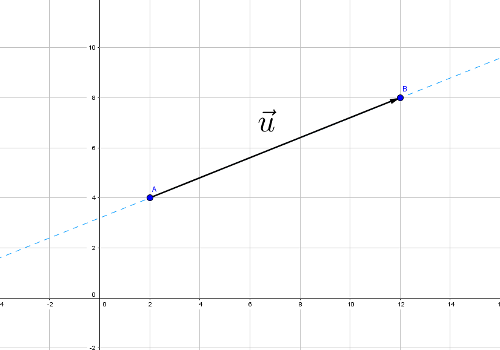
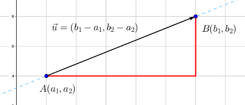
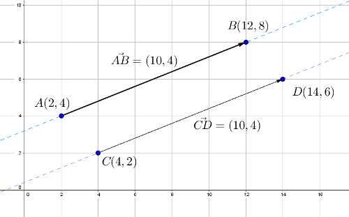
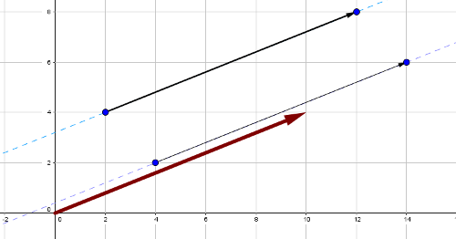

#Tema 5: Vectors en el pla

##Conceptes

###Definició

Un vector és un segment en el pla que determina una *direcció*, una *mòdul* o *magnitud* i un *sentit*. La direcció ve determinada per la recta sobre la qual es troba el vector, la magnitud és la llargada d'aquest vector i el sentit és, per entendre'ns, la punta de la fletxa del vector.

###Components cartesianes d'un vector

Donats dos punts $A=(a_1,a_2)$ i $B=(b_1,b_2)$ en el pla definim el vector $\vec{AB}$ com el segment que té origen en $A$ i final en $B$, tal i com hem vist a la figura anterior. Les coordenades del vector les calculem de la manera següent:

>$$\vec{AB}=(b_1-a_1,b_2-a_2)$$

El mòdul o llargada del vector,$|\vec{AB}|$,   el calculem aplicant el teorema de Pitàgores al triangle rectangle que defineix:

>$$|\vec{AB}|=\sqrt{(b_1-a_1)^2+(b_2-a_2)^2}$$

###Vectors equipol.lents

Dos vectors són equipol.lents si tenen la mateixa direcció, mòdul i sentit. En definitiva, si tenen les mateixes coordenades. A la pràctica, els vectors equipol.lents són paral.lels en el pla i podem passar de l'un a l'altre amb un senzill moviment de translació.

**Exemple 1**

Considera els punts en el pla $A(2,4)$, $B(12,8)$, $C(4,2)$ i $D(14,6)$. Dibuixa els vectors $\vec{AB}$ i $\vec{CD}$ i demostra que són equipol.lents.

Anem a calcular les components d'aquests vectors abans de dibuixar-los:

\begin{align}
    \vec{AB} &=(12-2,8-4)=(10,4)\\
    \vec{CD} &=(14-4,6-2)=(10,4)
\end{align}

Veiem que tenen les mateixes components.

>Cada conjunt de vectors equipol.lents representen un sol vector anomenat **vector lliure**.

Els vectors lliures normalment es representen amb origen el punt $O(0,0)$ i extrem les coordenades del vector.

<!---------------------------------------------------------->
##Operacions amb vectors

###Suma

Siguin $\vec{u}=(u_1,u_2)$ i $\vec{v}=(v_1,v_2)$, per sumar algebraicament dos vectors només cal que sumem les components dos a dos:

>$$\vec{u}+\vec{v}=(u_1+v_1,u_2+v_2)$$

 Si els sumem gràficament en el pla, aplicarem *la regla de paral.lelogram* per trobar gràficament el vector suma: es tracta de posar els dos vectors amb el mateix origen (típicament el punt $(0,0)$) i traçar rectes paral.leles als vectors. La diagonal del paral.lelogram que es forma és el vector suma.

<iframe scrolling="no" src="https://www.geogebra.org/material/iframe/id/2233817/width/1600/height/951/border/888888/rc/false/ai/false/sdz/true/smb/false/stb/false/stbh/true/ld/false/sri/true/at/auto" width="600px" height="300px" style="border:0px;"> </iframe>

###Resta

Donats $\vec{u}=(u_1,u_2)$ i $\vec{v}=(v_1,v_2)$, per restar-los algebraicament només cal que restem les components dos a dos:

>$$\vec{u}-\vec{v}=(u_1-v_1,u_2-v_2)$$

###Producte d'un nombre real per un vector
###Producte escalar
###Producte vectorial

<!---------------------------------------------------------->
##Combinació lineal entre vectors
###Vectors linealment independents i dependents

<!---------------------------------------------------------->
##Bases en el pla
###Canvis de base
###Base ortogonal i ortonormal
